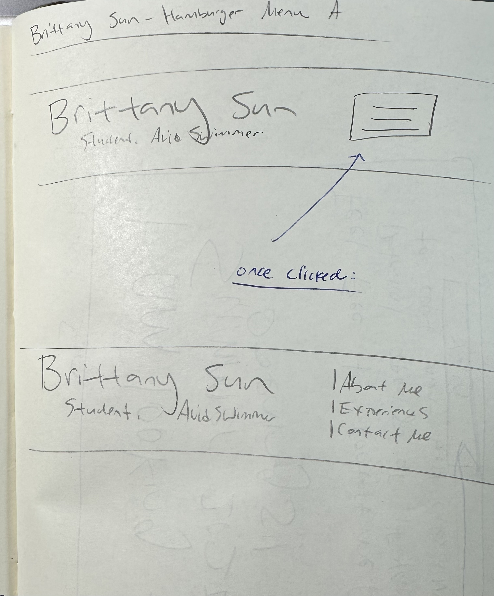

# Project 3, Milestone 1: Design Journey

[← Table of Contents](design-journey.md)


> **Replace ALL _TODOs_ with your work.** (There should be no TODOs in the final submission.)
>
> Be clear and concise in your writing. Bullets points are encouraged.
>
> Place all design journey images inside the "design-plan" folder and then link them in Markdown so that they are visible in Markdown Preview.
>
> **Everything, including images, must be visible in _Markdown: Open Preview_.** If it's not visible in the Markdown preview, then we can't grade it. We also can't give you partial credit either. **Please make sure your design journey should is easy to read for the grader;** in Markdown preview the question _and_ answer should have a blank line between them.


## Project
> Which project will you add interactivity to enhance the site's functionality?

Project 1


## Audience's Goals
> List the audience's goals that you identified in Project 1 or 2.
> Simply list each goal. No need to include the "Design Ideas and Choices", etc.
> You may adjust the goals if necessary.

- Learn more about background and my perspectives on life.
- What my professional interests are and where I want to take my studies.
- What my personal interests are and how they can understand me beyond the job application.


## Modal Interactivity Brainstorm
> Using the audience goals you identified, brainstorm possible options for **modal** interactivity to enhance the functionality of the site while also assisting the audience with their goals.
> Briefly explain each idea and provide a brief rationale for how the interactivity enhances the site's functionality for the audience. (1 sentence)
> Note: You may find it easier to sketch for brainstorming. That's fine too. Do whatever you need to do to explore your ideas.

- When the audience first opens the website, there is a pop-up welcoming them to my page and guessing a fun trivia question about me. This would highlight my personality to the audience and the trivia will be answered as the user then scrolls on my website

- When the audience goes to my experiences page, there could be a pop-up listing what is on page and they can click which one they are most interested in so it can jump to that section. The sections include: Technical Experiences, Community Experiences, and School Involvement. Since there is a lot of scrolling on the page, it would make sense to include this so users can easily navigate to what they want to see first.

- When users visit the contact me page, there would be a pop-up message that says I would love for the audience to connect with me for opportunities or inquiries. This goes to the goals of my audience because they came to my website to get to know more about me or find my contact information as the audience are people who would like to know me better, both personally and professionally. In some cases, they must want to contact me and this pop-up would tell them that yes! they would contact me for personal and professional reasons.


## Interactivity Design Ideation
> Explore the possible design solutions for the interactivity.
> Sketch at least two iterations of the modal and at least two iterations of the hamburger menu interactivity.
> Annotate each sketch explaining what happens when a user takes an action. (e.g. When user clicks this, something else appears.)
> Do not include HTML/CSS annotations in your sketches!

For my first iteration the hamburger menu, the navigation tabs open once the user clicks on it.


For my second iteration the hamburger menu, the navigation tabs once the user hovers over it and it only shows the additional two pages that the user is currently not on (since there is only 3 pages total).


My first modal is for my Home page, where I welcome the audience to my page saying this is the right place to get to know more about me and then ask a small trivia question. Both answering the trivia question and the x button at the top right corner closes this.


My second modal is for my Contact Me page, where I tell the audience I am looking for jobs as my main goal. But I am also free to chat about anything relating to my resume or myself. And then there is a button that says "Yay!" Both the button question and the x button at the top right corner closes this.


## Final Interactivity Design Sketches
> Create _polished_ design sketch(es) (it's still a sketch, but with a little more care taken to communicate ideas clearly to the graders) to plan your interactivity.
> **Sketch out the entire page where your interactivity will go.**
> Include your interactivity to the sketch(es).
> Add annotations to explain what happens when the user takes an action.
> Include as many sketches as necessary to communicate your design (ask yourself, could another 1300 take these sketches an implement my design?)

**Modal design sketches:**

This is the modal for the Contact Me page narrow screen. The interactivity to close this pop-up will be clicking on the x at the top right corner or the "Yay!" at the bottom.

I also annotated the design principles.


This is the modal for the Contact Me page wide screen. The interactivity to close this pop-up will be clicking on the x at the top right corner or the "Yay!" at the bottom.

I also annotated the design principles.


**Hamburger drop-down navigation menu design sketches:**

This is the hamburger dropdown menu for every page of my website. The interactivity is clicking the dropdown button image to open the navigation tab.
I also annotated the design principles.


## Interactivity Rationale
> Describe the purpose of your proposed interactivity.
> Provide a brief rationale explaining how your proposed interactivity addresses the goals of your site's audience.
> This should be about a paragraph. (2-3 sentences)

My proposed interactivity addresses the goals of the site's audience because:

- For the modal, the audience might feel hesitant to contact me if they feel like they do not have a good-enough reason. With the modal, I make it very open that I am more than happy to keep in touch with them for topics like job opportunities and chatting about interests.
- For my hamburger menu for the narrow screen, it tells the user what the current page they are on and the 2 other options for them to navigate to. It makes the narrow screen version of my website navigation bar concise and easy to navigate and look at. The users would also know what to expect from each page with the name of the tabs.

## Interactivity Planning Sketches
> Produce planning sketches that include all the details another 1300 student would need to implement your interactivity design.
> Your planning sketches should include _all_ HTML elements needed for the interactivity; _annotations_ for the element types, their unique IDs, and CSS classes; and lastly the initial CSS classes.
> This is asking you to create a planning sketch like the one we did during the in-class activity.

**Modal planning sketches:**

For my modal planning,

- The HTML elements I need are < img > to display the modal, < button > for the two buttons to close the modal, < h3 > for the larger text on the modal, and < p > for the smaller text on the modal.
- The < img > will have an class="modal." This will reflect in the CSS for it to show or not on screen.
- The CSS classes include .modal{}, #buttonA, and #buttonB.
- The initial CSS class will be the green box, where the modal is displayed. Once either of the buttons are clicked, then the modal is no longer displayed (pink box)


**Hamburger drop-down navigation menu planning sketches:**

For my hamburger dropdown menu planning,

- The HTML elements I need are < img > to display the dropdown, < button > for the button to open the dropdown, < section > for once the dropdown is open, to display the navigation menu options, and < p > to show the uiser which tab they are currently on
- The < img > will have an class="dropdown." This will reflect in the CSS for it to show or not on screen.
- The CSS classes include .dropdown{}, #button1.
- The initial CSS class will be the green box, where the dropdown options are not displayed but the hamburger menu button is displayed. Once the buttons are clicked, then the dropdown image is no longer displayed (pink box) but the options are.


## Interactivity Pseudocode Plan
> Write your interactivity pseudocode plan here.
> Pseudocode is not JavaScript. Do not put JavaScript code here.

**Modal pseudocode:**

> Pseudocode to open the modal:

```
when #contact is clicked (event):
   remove .modal from #itemA

```

> Pseudocode to close the modal:

```
when #buttonA is clicked (event):
    add .modal to #itemA

OR

when #buttonB is clicked (event):
    add .modal to #itemA

```

**Hamburger menu pseudocode:**

> Pseudocode to show/hide (toggle) the navigation menu (narrow screens) when the hamburger button is clicked:

```
when the hamburger button is clicked:
  if the navigation menu is not visible:
    remove .dropdown from #button1
    add .menu to #button1

  else:
    add .dropdown to #button1
    remove .menu from #button1

```

> Media queries are prohibited to show/hide the hamburger menu for this assignment.
> (I want you to demonstrate the interactivity learning objectives we covered in class.)
> If the browser window is narrow when the page loads, the hamburger button should be visible and the navigation should be hidden.
> If the browser window is wide when the page loads, the hamburger menu should not be visible.
> Complete the pseudocode to show/hide (toggle) the navigation on page load:

```
on page load (ready):
  if window is narrow:
    add .dropdown to #button1
    remove .menu from #button1

   else if window is wide:
     remove .dropdown from #button1
     add .menu to #button1
```

> If the browser window is resized from wide to narrow, the hamburger menu should become visible and the navigation should be hidden.
> If the browser window is resized from narrow to wide, the hamburger menu should become hidden and the navigation should be visible.

```
on window resize:
  if window is narrow:
    remove .dropdown from #button1
     add .menu to #button1

  else if window is wide:
    add .dropdown to #button1
    remove .menu from #button1
```

## References

I went to office hours on Tuesday, November 5th 6-7PM.

### Collaborators
> List any persons you collaborated with on this project.

I did not collaborate with anyone.

### Reference Resources
> Did you use any resources not provided by this class to help you complete this assignment?
> List any external resources you referenced in the creation of your project. (i.e. W3Schools, StackOverflow, Mozilla, etc.)
>
> List **all** resources you used (websites, articles, books, etc.), including generative AI.
> Provide the URL to the resources you used and include a short description of how you used each resource.

- W3Schools: [display:](https://www.w3schools.com/css/css_display_visibility.asp)

[← Table of Contents](design-journey.md)
